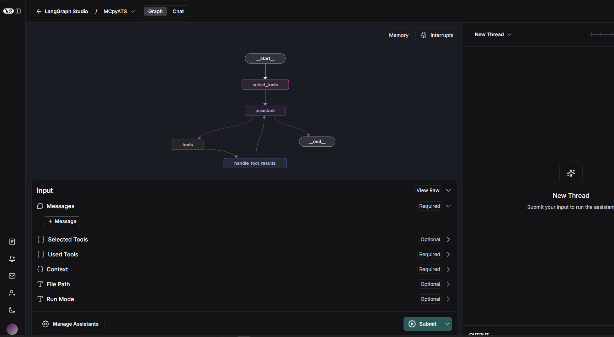

<<<<<<< HEAD
<<<<<<< HEAD
# mcp_pyats
=======
# pyATS_MCP
An MCP Server for pyATS (experimental)
>>>>>>> b1d12e9 (initial)
=======
# 🧠 MCPyATS: AI-Powered Network Automation with MCP + Cisco pyATS

## 🚀 Overview
MCPyATS brings together the Model Context Protocol (MCP) and Cisco pyATS to build intelligent, distributed agents capable of automating network tasks via natural language. 

It includes multiple tool-integrated MCP servers, a LangGraph agent backend, a Streamlit UI frontend, and support for A2A (Agent-to-Agent) communication.

📁 Repository Structure
```bash
MCPyATS/
├── a2a/              # Agent-to-Agent Adapter implementation
├── drawio/           # Custom local Draw.io instance with MCP integration
├── mcp_servers/      # All MCP tool servers (Slack, GitHub, ServiceNow, etc.)
├── mcpyats/          # LangGraph-based MCP agent using pyATS and tools
├── streamlit/        # Streamlit web frontend on port :8501
├── shared_output/    # Volume-mounted folder for shared artifact storage
├── .env.example      # Sample environment file (copy to .env and update)
└── docker_startup.sh # Startup script to launch 
```

## 🛠️ Quick Start
🛠️ Quick Start
Clone the repo

```bash
git clone https://github.com/automateyournetwork/MCPyATS

cd MCPyATS
```

Prepare your environment

Create your .env file based on the sample provided:

```bash
cp .env.example .env
```

Update all the required API keys, tokens, and paths inside .env.

Launch the system

```bash
./docker_startup.sh
```

This will bring up:

All MCP servers

The LangGraph MCPyATS agent

The Draw.io integration

The Streamlit frontend

The A2A adapter

🔍 Component Breakdown

🔁 a2a/ – Agent-to-Agent Adapter
Implements the A2A protocol allowing agents to collaborate over the web. Enables decentralized automation via peer-discovered agents.

🧩 mcp_servers/ – Tool Servers
Collection of Dockerized MCP servers. Each server exposes a set of structured tools using JSON-RPC or HTTP.

➡️ See individual folders inside mcp_servers/ for tool-specific README files.

🖊 drawio/ – Local Draw.io Instance
Customized Draw.io instance that:

Sends/receives shapes and diagrams via WebSockets

Converts network diagrams into configs

Supports AI-assisted topology generation

🧠 mcpyats/ – MCPyATS Agent
Main LangGraph-based AI agent:

Integrates with Cisco pyATS

Dynamically discovers tools via MCP

Uses GPT/LLM APIs to reason and act on network tasks

🗃️ shared_output/ – Shared Volume
Common storage directory used across MCP servers and the agent for:

Artifacts

JSON outputs

Diagrams and reports

🌐 streamlit/ – Frontend UI

Streamlit-based web interface at http://localhost:8501 to:

Interact with the MCPyATS agent

Submit prompts

View structured responses and artifacts

🔐 Environment Variables

A full .env.example file is included. You must rename it to .env and provide your secrets.

(See .env.example for the complete list.)

## .ENV Variables

PYATS_TESTBED_PATH= Path to your pyATS testbed YAML file

GOOGLE_API_KEY= Google API Key for Gemini LLM

OPENAI_API_KEY= OpenAI API Key for GPT-3.5 or GPT-4 if using OpenAI for LLM

WEATHER_API_KEY= OpenWeatherMap API Key for weather data

ABUSEIPDB_API_KEY= AbuseIPDB API Key for IP reputation checks

LangSmith Tracing and integration

LANGSMITH_TRACING= LangSmith tracing enabled (true/false)

LANGSMITH_API_KEY= LangSmith API key

LANGSMITH_ENDPOINT= LangSmith endpoint

LANGSMITH_PROJECT= LangSmith project name

Github MCP

GITHUB_USERNAME= GitHub username

GITHUB_TOKEN= GitHub token

GOOGLE_MAPS_API_KEY= Google Maps API key

Slack MCP

SLACK_BOT_TOKEN= Slack bot token

SLACK_TEAM_ID= Slack team ID

SLACK_CHANNEL_ID= Slack channel ID

Selector MCP

SELECTOR_AI_API_KEY= Selector AI API key

SELECTOR_URL= Selector API URL

FileSystem MCP

FILESYSTEM_PATH= Path to the local filesystem to be used by the FileSystem MCP server default mapped to shared_output/

NETBOX MCP

NETBOX_URL= NetBox API URL

NETBOX_TOKEN= NetBox API token

ServiceNow MCP

SERVICENOW_URL= ServiceNow instance URL

SERVICENOW_USERNAME= ServiceNow username

SERVICENOW_PASSWORD= ServiceNow password

Google Email MCP

EMAIL_HOST= SMTP server host (e.g., smtp.gmail.com)

EMAIL_PORT= SMTP server port (e.g., 587 for TLS)     

EMAIL_SSL= Enable SSL (true/false)

EMAIL_ACCOUNT= Email account to send from (e.g.,

EMAIL_PASSWORD= Email account password

NIST MCP

NVD_API_KEY= NIST NVD API key

Agent-to-Agent MCP Output DIR

AGENT_CARD_OUTPUT_DIR= Path to the directory where the agent card will be saved

A2A Peer Agents

A2A_PEER_AGENTS= Comma-separated list of peer agent URLs for A2A communication

## LangGraph Agent

🧠 LangGraph Agent (mcpyats/)
The LangGraph Agent is the heart of MCPyATS. It is an AI-powered orchestrator that dynamically discovers and invokes tools across local and remote MCP servers using Cisco pyATS, LangGraph, and structured agent patterns.

🔧 What It Does
Dynamically discovers tools from:

Dockerized MCP containers (via STDIO or HTTP)

A2A peer agents (via .well-known/agent.json)

Local tools inside the tools/ folder

Binds all discovered tools to an LLM (OpenAI or Gemini)

Interprets natural language and chooses the most relevant tools

Generates an A2A-compliant agent.json file with all skills

Handles tool output, context memory, fallback, retries, and delegation

📜 Key Files

File	Purpose

mcpyats.py	The main LangGraph agent implementation

startup.sh	Script used in Dockerfile to launch the LangGraph dev server

tools/	Folder with custom tools for CLI, filesystem, network

langgraph.json	Entry point for LangGraph CLI-based execution

.well-known/agent.json	Auto-generated A2A agent card with all available tools

🧱 Architecture




```csharp

START

  ↓

[select_tools]  ←─ Vector + LLM-assisted tool filtering

  ↓

[assistant]     ←─ LLM bound to selected tools and context

  ↓

[tools]         ←─ Executes structured tool 

calls via MCP or delegation

  ↓

[handle_tool_results] ←─ Updates state, context, 

summaries

  ↓

[assistant]     ←─ Final reply or new tool 

request

  ↓

END or tools again
```

⚙️ Tool Discovery Logic

To add a new MCP server:

Edit this section in mcpyats.py:

```python

tool_services = [
    ("pyats-mcp", ["python3", "pyats_mcp_server.py", "--oneshot"], "tools/discover", "tools/call"),
    ("drawio-mcp", "http://host.docker.internal:11434/rpc", "tools/list", "tools/call"),
    ...
]

```
Supported types:

STDIO-based containers using docker exec

HTTP JSON-RPC endpoints with tools/list and tools/call

🧬 A2A Agent Card
A .well-known/agent.json is auto-generated and published by the agent:

```json
{
  "name": "pyATS Agent",
  "description": "Cisco pyATS Agent with access to many MCP tools",
  "url": "https://your-agent-url",
  "methods": {
    "send": "https://your-agent-url/"
  },
  "capabilities": {
    "a2a": true,
    "tool-use": true,
    "chat": true,
    "push-notifications": true
  },
  "skills": [
    {
      "id": "pyATS_run_show_command",
      "description": "Runs a show command on a device"
    },
    ...
  ]
}
```
This allows other A2A agents to discover and delegate tasks to your MCPyATS instance.

🧪 Local Development
To run the agent locally:

```bash

cd mcpyats/

langgraph dev --host 0.0.0.0 --port 2024
```

LangGraph will use the langgraph.json file:


```json
{
  "entrypoints": {
    "MCpyATS": "mcpyats:compiled_graph"
  },
  ...
}
```

🧠 LangGraph Agent: How It Works

🧩 Agent Flow Diagram (from Studio UI)

Here's the LangGraph pipeline you uploaded (langgraph_studio.png), annotated:


```pgsql
START

  ↓

select_tools       ← Vector search + LLM filtering

  ↓

assistant          ← LLM + tool binding (uses selected tools)

  ↘         ↙

   tools → handle_tool_results

      ↖───────────↩

        |

        ↓

      END          ← if no tool call is required
```

🔍 Breakdown of Each Node

1. select_tools (🔎 Tool Selector using RAG)
Function: Selects the most relevant tools for the user’s prompt.

How:

Vector search over descriptions using InMemoryVectorStore.

Applies a similarity threshold (0.50), falls back to top K if needed.

Then sends the shortlisted tools to the LLM for final selection.

Why: Avoids overcalling all tools, keeps only top matches active for this run.

2. assistant (🤖 LLM Execution)
Function: Acts as the LLM agent core.

How:

Starts with a system prompt tailored for tool reasoning (tool usage rules).

Uses .bind_tools() with selected tools.

Interprets user messages + memory + file content and decides:

Make a tool call → → tools

Or finish → → END

Tool Mode: If the agent emits tool_calls, LangGraph routes to tools.

3. tools (🛠 Context-Aware Tool Executor)
Function: Executes all tool calls selected by the assistant.

How:

Each tool is a wrapper over an MCP container (via HTTP or STDIO).

Results are converted to ToolMessage objects and added to memory.

Special patch: handles read_file path fix, tool errors, JSON outputs.

Output: Raw results + parsed outputs are saved to context.

4. handle_tool_results (🪄 Post-processing)
Function: Normalizes the tool responses.

How:

Rewrites any messages with improper roles (model → agent).

Ensures context gets updated.

Then loops back to assistant to continue the flow.

🛜 Hosted Interface Links (update IP for local use)

🔗 Name	URL

🚀 API (LangGraph)	http://127.0.0.1:2024

🎨 Studio UI	LangGraph Studio

📚 API Docs	http://127.0.0.1:2024/docs

🔄 Summary of Technologies

Layer	Component

🧠 LLM	ChatOpenAI or ChatGoogleGenerativeAI (Gemini)

🧮 Embeddings	GoogleGenerativeAIEmbeddings

🗂️ RAG Store	InMemoryVectorStore

🛠️ Tools	Tool / StructuredTool from MCPs (Docker or HTTP)

🔗 Delegation	A2A-compatible agents via delegate_task_to_peer_agent

🧱 Graph Engine	LangGraph with StateGraph and dynamic routing

## MCP Servers

The `mcp_servers/` directory houses all modular MCP-compliant tool servers. Each folder represents an individual service that exposes structured tools over STDIO or HTTP, and can be independently containerized.

📦 Included MCP Servers:

- `chatgpt` – Interface with OpenAI models via structured tool calls  
  → [./mcp_servers/chatgpt/README.md](./mcp_servers/chatgpt/README.md)

- `drawio_mcp` – Communicate with a browser-based Draw.io instance using WebSockets or HTTP  
  → [./mcp_servers/drawio_mcp/README.md](./mcp_servers/drawio_mcp/README.md)

- `email` – Send email using SMTP  
  → [./mcp_servers/email/README.md](./mcp_servers/email/README.md)

- `excalidraw` – Generate freeform drawings and diagrams  
  → [./mcp_servers/excalidraw/README.md](./mcp_servers/excalidraw/README.md)

- `filesystem` – Read, write, edit, and manage files on the host system  
  → [./mcp_servers/filesystem/README.md](./mcp_servers/filesystem/README.md)

- `github` – Perform GitHub repo actions like push, commit, or create issues  
  → [./mcp_servers/github/README.md](./mcp_servers/github/README.md)

- `google_maps` – Geocoding and location data tools  
  → [./mcp_servers/google_maps/README.md](./mcp_servers/google_maps/README.md)

- `google_search` – Perform Google search queries  
  → [./mcp_servers/google_search/README.md](./mcp_servers/google_search/README.md)

- `mermaid` – Generate diagrams from Mermaid syntax  
  → [./mcp_servers/mermaid/README.md](./mcp_servers/mermaid/README.md)

- `vegalite` – Create charts and plots from VegaLite specs  
  → [./mcp_servers/vegalite/README.md](./mcp_servers/vegalite/README.md)

- `quickchart` – Generate standard charts via QuickChart  
  → [./mcp_servers/quickchart/README.md](./mcp_servers/quickchart/README.md)

- `netbox` – Query and manipulate NetBox resources  
  → [./mcp_servers/netbox/README.md](./mcp_servers/netbox/README.md)

- `nist` – Look up CVEs and vulnerabilities from the NIST NVD  
  → [./mcp_servers/nist/README.md](./mcp_servers/nist/README.md)

- `pyats_mcp_server` – Run pyATS commands, parse configs, test connectivity  
  → [./mcp_servers/pyats_mcp_server/README.md](./mcp_servers/pyats_mcp_server/README.md)

- `rfc` – Search and retrieve IETF RFC documents  
  → [./mcp_servers/rfc/README.md](./mcp_servers/rfc/README.md)

- `sequentialthinking` – Logical task planning and chaining  
  → [./mcp_servers/sequentialthinking/README.md](./mcp_servers/sequentialthinking/README.md)

- `servicenow` – Create and manage ServiceNow tickets  
  → [./mcp_servers/servicenow/README.md](./mcp_servers/servicenow/README.md)

- `slack` – Post messages or react to threads in Slack  
  → [./mcp_servers/slack/README.md](./mcp_servers/slack/README.md)

Each server folder includes a `Dockerfile` and a `server.py` or `index.ts` (depending on language/runtime) that defines the available tools and communication logic.

## 🔄 A2A Adapter – Agent-to-Agent Interface for MCPyATS

This component exposes your LangGraph-based MCP agent to the public web using the **Agent-to-Agent (A2A)** protocol. It enables **cross-agent collaboration** by accepting and delegating structured tasks via standard JSON-RPC.

It also supports **push notifications**, **Slack integration**, and **public discovery** using `.well-known/agent.json`.

---

### 🌐 Features

- Accept tasks over HTTP via standard A2A `send` method

- Serve `.well-known/agent.json` for agent discovery

- Auto-discover and wrap peer agents and their tools

- Optionally broadcast results via Slack

- Push results to external A2A UIs

---

### 📦 Folder Structure

a2a/
├── a2a_adapter.py # Main FastAPI application (the adapter)
├── Dockerfile # Container for exposing the A2A adapter
├── requirements.txt # Required Python packages
├── .well-known/
│ └── agent.json # This agent's public card for peer discovery


### 🛠 Requirements

- Python 3.11

- LangGraph-compatible MCP agent (running on port `:2024`)

- Optional: Slack Bot Token and Channel ID for notifications

---

## 📄 agent.json

Your `.well-known/agent.json` file exposes your agent’s identity, capabilities, and tools:

```json
{
  "name": "pyATS Agent",
  "description": "Cisco pyATS Agent with access to many MCP tools",
  "url": "https://your-ngrok-or-public-url",
  "methods": {
    "send": "https://your-ngrok-or-public-url/"
  },
  "capabilities": {
    "a2a": true,
    "tool-use": true,
    "chat": true,
    "push-notifications": true
  },
  "skills": [
    {
      "id": "pyATS_run_show_command",
      "description": "Runs a show command on a device"
    }
    ...
  ]
}
```

⚙️ Environment Variables

Place these in your .env file or docker compose:

```env
# Adapter settings
A2A_PORT=10000
LANGGRAPH_URL=http://host.docker.internal:2024
AGENT_ID=MCpyATS
AGENT_CARD_PATH=/a2a/.well-known/agent.json

# Push target (optional)
A2A_PUSH_TARGET_URL=http://your-ui-or-broker/receive_push

# Public file URL (for charts, images, etc.)
PUBLIC_BASE_URL=https://your-ngrok-url

# Slack integration (optional)
SLACK_BOT_TOKEN=your_bot_token
SLACK_CHANNEL_ID=C1234567890

# Auto-discovery peers
A2A_PEER_AGENTS=https://agent1.com,https://agent2.ai
```

🚀 Run Locally

```bash
uvicorn a2a_adapter:app --host 0.0.0.0 --port 10000
```

Or with Docker:

```bash

docker build -t a2a-adapter .
docker run -p 10000:10000 --env-file .env a2a-adapter
🔗 Endpoints
Endpoint	Purpose
GET /.well-known/agent.json	Discovery endpoint for peer agents
POST /	Accept A2A task requests (method: send)
POST /send_to_peer	Utility to forward a task to a peer
GET /	Health check
GET /output/*	Serve artifacts (images, charts, etc.)
```

✨ Features

✅ Peer Discovery

Automatically fetches peer agent.json files from the A2A_PEER_AGENTS list and dynamically wraps their tools for use inside LangGraph.

🧠 Delegation

Uses delegate_task_to_peer_agent(...) to send subtasks to other A2A agents over the web, enabling multi-agent cooperation.

📎 Artifact Hosting

Any .png or .svg dropped into /output/ will be served publicly. URLs are included in artifacts.uri in responses.

📣 Push Notifications

Sends proactive responses to a remote system via A2A_PUSH_TARGET_URL.

🔐 Security Notes

You can expose the adapter using ngrok, a reverse proxy, or directly from a public DMZ.

No authentication is enabled by default—consider reverse proxies or middleware for auth in production.

🧪 Example Usage
```bash
curl -X POST http://localhost:10000/send_to_peer \
  -H "Content-Type: application/json" \
  -d '{
    "agent_url": "https://agent.example.com",
    "message": "Check if R1 interface Gi0/1 is up"
  }'
```

🧱 Based On

FastAPI for serving HTTP API

httpx for async networking

LangGraph for AI coordination

slack_sdk for notifications

uvicorn as ASGI server

✅ Next Steps

Connect this agent to a public registry

Add your A2A endpoint to A2A_PEER_AGENTS in other agents

Use LangGraph memory + tools to build collaborative tasks

## docker_startup.sh

🚀 docker_startup.sh – One-Command Launcher for MCPyATS

This script automates the full build and launch of all Dockerized components in the **MCPyATS** system, including:

- ✅ All `mcp_servers/` (tool containers)

- ✅ The LangGraph-based `mcpyats` agent

- ✅ The Streamlit frontend

- ✅ The Draw.io + WebSocket integration

- ✅ The A2A (Agent-to-Agent) Adapter

---

## 🧩 What It Does

### 🔨 1. Builds all MCP server images:

For each directory in `./mcp_servers/`, this script:

- Builds the Docker image using `docker build`

- Tags it appropriately (e.g., `github-mcp`, `servicenow-mcp`)

Includes servers for:

- GitHub, Google Maps, ServiceNow, Slack, NetBox

- Filesystem, Email, NIST, QuickChart, RFC, Mermaid, etc.

### 🧱 2. Builds infrastructure containers:

- `mcpyats` – The LangGraph agent

- `a2a-adapter` – A2A FastAPI adapter

- `drawio` and `drawio-mcp` – for visual topology editing

- `streamlit-app` – web UI on `http://localhost:8501`

### 🧪 3. Launches each container with proper environment configuration:
- Reads `.env` for tokens and keys

- Mounts local paths (e.g., `shared_output/`)

- Uses `--env-file .env` where applicable

- Ensures persistent volumes for artifacts and testbed files

- Opens required ports (e.g., `10000`, `2024`, `8501`, `8080`, `3000`, `11434`)

---

## ✅ Usage

Ensure you have a valid `.env` file configured (copy from `.env.example`):

```bash
cp .env.example .env
nano .env  # fill in tokens and secrets
```

Then run:

```bash
./docker_startup.sh
```

## Streamlit UI

🌐 Streamlit UI – Frontend for MCpyATS

This directory provides a lightweight Streamlit-based web interface for interacting with the **MCpyATS** LangGraph AI agent.

It enables natural language chat with your network and connected MCP tools (via HTTP), and provides a visual entry point for interacting with all your infrastructure agents.

---

## 🚀 Features

- 💬 **Chat Interface** to ask network, Slack, GitHub, and AI questions

- 🧠 Uses LangGraph agent on port `:2024` via `/threads/.../runs/stream` API

- ⚙️ Dynamically uses MCP tools like `pyats_mcp_server`, `drawio`, `github`, `filesystem`, etc.

- 📎 Supports artifact visualization (charts, maps, outputs, etc.)

- 🖼 Includes logo and branding via `logo.jpeg`

---

## 📁 Structure

```bash
streamlit/
├── Dockerfile        # Builds and runs Streamlit app
├── streamlit.py      # Main Streamlit frontend logic
├── logo.jpeg         # Logo displayed at the top of the app
🐳 Docker Usage

You can build and run the Streamlit app using the included Dockerfile:

```bash
docker build -t streamlit-app ./streamlit

docker run -d --name streamlit-app -p 8501:8501 streamlit-app
```

Then open:

```arduino
http://localhost:8501
```

🧪 Local Dev Usage

If you prefer to run locally with Python:

```bash
pip install streamlit requests

cd streamlit/
streamlit run streamlit.py
```

⚙️ Configuration

The frontend expects your LangGraph agent to be running at:

```arduino
http://host.docker.internal:2024
```

This is set in the code via:

```python
API_BASE_URL = "http://host.docker.internal:2024"
```

You can change this to http://localhost:2024 or a public agent URL if needed.

💬 Prompting Guide

Some examples you can use in the prompt box:

Task	Example Prompt

Network config	"Show running config for R1"

Slack message	"Send 'Hello team!' to Slack"

Google Maps location	"Find pizza places near New York"

Filesystem read	"Read the file named config_backup.txt"

GitHub interaction	"Create README.md in repo mynetwork"

Excalidraw chart	"Draw a network diagram with R1, R2, and SW1"

BGP / Geolocation / Whois	"Show geolocation for 8.8.8.8"

🧠 State Management

Stores chat thread_id in st.session_state

Preserves message history across user turns

Dynamically parses streaming responses from LangGraph including:

Tool output (tool_call_id)

Direct content (content)

Tool feedback (e.g., Slack success/failure)

📦 Dependencies

This app installs the following Python packages:

```txt
streamlit
requests
```

Already included in the Dockerfile:

```Dockerfile
RUN pip install requests
RUN pip install streamlit
```

🛠 Development Notes

Runs on port 8501

Accepts prompt input via st.chat_input

Supports both raw text replies and structured tool messages

Gracefully handles tool call responses, JSON decoding, and missing fields

Can be extended to support file uploads and session tagging

🔗 Access

Once running, access the UI via:

```arduino
http://localhost:8501
```

If deployed remotely, update your .env and reverse proxy as needed.

## Final healthy containers view

# 🟢 Post-Startup: What to Expect

Once you run the `./docker_startup.sh` script successfully, MCPyATS will:

✅ **Build and start 20+ Docker containers**  

✅ **Expose local and web-accessible endpoints**  

✅ **Enable real-time interaction across AI, automation, visualization, and collaboration layers**

---

## 🚀 Services and Ports

Below is a complete list of the key containers, their roles, and exposed ports:

| Service             | Container Name      | Description                                              | Port(s)                |
|---------------------|---------------------|----------------------------------------------------------|------------------------|
| LangGraph Agent     | `mcpyats`           | Core LangGraph-based AI orchestrator                     | `:2024`                |
| Streamlit UI        | `streamlit-app`     | Web frontend for natural language interface              | `:8501`                |
| Draw.io (MCP)       | `drawio-mcp`        | MCP server with WebSocket + TCP tool bridge              | `3000`, `11434`        |
| Draw.io (Local)     | `drawio-local`      | Browser-accessible standalone Draw.io instance           | `:8080`                |
| A2A Adapter         | `a2a-adapter`       | Agent-to-Agent communication adapter                     | `:10000`               |

---

## 🧰 MCP Tool Servers (Autonomous Backends)

The following MCP containers are launched in the background and made available to the LangGraph agent:

| MCP Server            | Container ID       | Container Name          | Description                          |
|-----------------------|--------------------|--------------------------|--------------------------------------|
| Filesystem            |                    | `filesystem-mcp`        | Read/write local files               |
| NetBox                |                    | `netbox-mcp`            | Query network source-of-truth        |
| Google Search         |                    | `google-search-mcp`     | Web search interface                 |
| ServiceNow            |                    | `servicenow-mcp`        | Create/update problem tickets        |
| Email (SMTP)          |                    | `email-mcp`             | Send outbound emails                 |
| ChatGPT               |                    | `chatgpt-mcp`           | Interface with OpenAI GPT models     |
| pyATS                 |                    | `pyats-mcp`             | Execute network commands             |
| QuickChart            |                    | `quickchart-mcp`        | Generate simple charts               |
| VegaLite              |                    | `vegalite-mcp`          | Create JSON-driven charts            |
| Mermaid               |                    | `mermaid-mcp`           | Render Mermaid syntax diagrams       |
| RFC                   |                    | `rfc-mcp`               | Retrieve IETF RFCs                   |
| NIST NVD              |                    | `nist-mcp`              | Vulnerability and CVE data           |

---

## ✅ Final Confirmation

When complete, you should see output like:

```bash
✅ drawio-mcp container running with both STDIO + WebSocket

✅ mcpyats container started at http://localhost:2024

✅ streamlit-app container started at http://localhost:8501

✅ local drawio container started at http://localhost:8080

✅ a2a-adapter container listening on http://localhost:10000
```

You can also verify running containers with:


```bash
docker ps
```

🧪 Test the System

Visit http://localhost:8501 → Interact with MCpyATS via Streamlit

Use curl http://localhost:2024/docs to see API docs

Open http://localhost:8080 for standalone Draw.io

Post JSON to http://localhost:10000 to test A2A messaging

Watch logs with docker logs -f mcpyats

🔄 Restarting

If you make code changes, restart individual containers with:

```bash
docker restart mcpyats
docker restart streamlit-app
```

Or restart all:

```bash
docker rm -f $(docker ps -aq)
./docker_startup.sh
```

📁 Shared Output

Many containers mount and use this shared volume:

```bash
/home/johncapobianco/MCPyATS/shared_output → /projects or /output
```
You should adjust this to your path 

This allows tools like Filesystem MCP, Chart generators, and Draw.io to exchange files and artifacts in real time.
>>>>>>> 0df9922 (readme and restructure)
